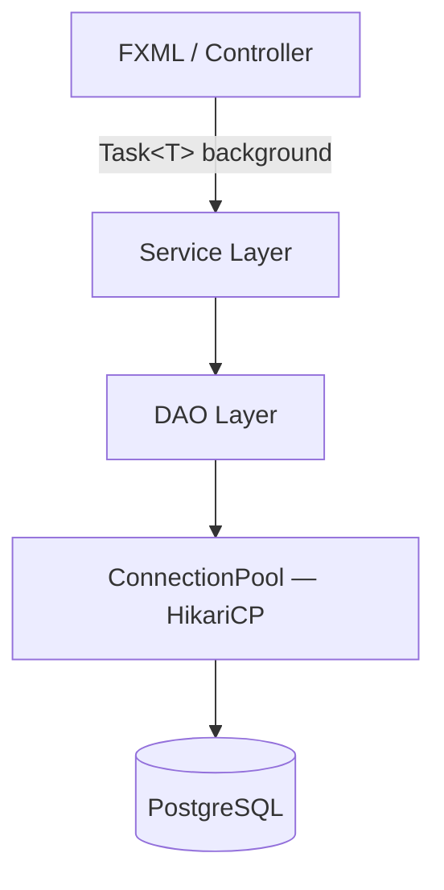

# ThomPharma

> Sistema desktop de gestão para farmácias de manipulação, desenvolvido em **Java 11 + JavaFX 13 + PostgreSQL**.
> Arquitetura em camadas (Controller → Service → DAO → Pool), operações assíncronas com `Task<T>`, segurança com bcrypt e proteção anti-brute-force persistida em banco.


---

## O que é?

Farmácias de manipulação lidam com um fluxo operacional complexo: receitas médicas, controle de matérias-primas por lote e validade, pedidos com rastreabilidade prescritor→paciente, e rótulos de embalagem com código sequencial diário. Planilhas não escalam — e sistemas genéricos não entendem o domínio.

O **ThomPharma** foi construído especificamente para esse contexto. Ele centraliza cadastros, estoque, produção e rastreabilidade em uma única aplicação desktop, com interface dark profissional e operações de banco de dados que nunca travam a tela.

**Público-alvo:** farmácias de manipulação de pequeno e médio porte que precisam de controle operacional real sem depender de cloud ou licenças recorrentes.

---

## Sumário

1. [Screenshots](#screenshots)
2. [Funcionalidades por módulo](#funcionalidades-por-módulo)
3. [Diferenciais técnicos](#diferenciais-técnicos)
4. [Arquitetura](#arquitetura)
5. [Stack tecnológico](#stack-tecnológico)
6. [Segurança](#segurança)
7. [Estrutura do projeto](#estrutura-do-projeto)
8. [Como executar](#como-executar)
9. [Roadmap](#roadmap)
10. [Autor](#autor)

---

## Screenshots

### Login

> Autenticação com bcrypt, bloqueio automático após 5 tentativas erradas (15 min, persistido em banco), migração automática de senhas legadas em texto puro.

---

### Menu Principal

> Navegação em três seções: **Cadastros**, **Operações** e **Sistema**. Botões desabilitados automaticamente para perfil Operador (Mat. Primas, Tabelas, Relatórios). Usuário logado e perfil exibidos no cabeçalho.

---

### Dashboard Executivo
> KPIs operacionais em tempo real: pedidos do dia, fila de produção, estoque crítico, lotes vencidos, fórmulas ativas e rótulos emitidos. Todas as queries rodam em background (`Task<T>`) — a tela nunca trava.

---

### Clientes

> Cadastro completo com máscara de CPF, dois telefones, e-mail, data de nascimento, percentual de desconto padrão, endereço com CEP e campo de observações clínicas (ex: alergias). Busca em tempo real pelo nome.

---

### Prescritores

> Suporte a múltiplos conselhos: CRM, CRO, CRV, CRP, CRN, CREFITO. Número de registro validado por unicidade dentro do mesmo tipo. Filtro combinado por nome e tipo de registro.

---

### Matérias-Primas

> Controle de estoque com alertas de nível mínimo e crítico. Flags de controle ANVISA, necessidade de geladeira e impressão de rótulo. Tipo: Sólido, Líquido, Homeopatia, Floral, Cápsula, Excipiente.


> Cada matéria-prima tem seus lotes listados abaixo (custo, quantidade, saldo, validade com `LocalDate`, fornecedor). Campo de sinônimos permite buscar a substância por nomes alternativos.

---

### Receitas (Fórmulas)

> Cadastro de fórmulas com nome fantasia, tipo (Floral, Cápsula, Creme, Homeopatia, Dose Única…) e lista de ingredientes com quantidade e unidade. Uma receita pode ser reutilizada em múltiplos pedidos.

---

### Pedidos de Manipulação

> Fluxo completo: **Aguardando → Em Produção → Pronto → Entregue**. Cada pedido vincula cliente, prescritor, receita base e itens específicos com quantidades. Data do pedido e data de retirada separadas.

---

### Rótulos de Embalagem

> Rótulo gerado automaticamente ao mover um pedido para "Em Produção". Código sequencial diário no formato `DDMMAA/NN`. Campos editáveis: posologia, validade, observações, dimensões (mm). Botão de impressão direta.

---

### Calculadora Farmacêutica

> Quatro modos de cálculo: **Floral**, **Homeopatia Líquida**, **Homeopatia Glóbulos** e **Dose Única**. Para florais: volume total + número de florais → ml/floral, gotas/floral, volume do veículo.


> Resultado exibido em área de texto com breakdown por floral, pronto para comunicar ao farmacêutico manipulador.

---

### Relatórios

> **Pedidos por Período:** filtro de data De/Até e status. Exibe cliente, prescritor, fórmula, status e data de retirada. Botão Imprimir.


> **Estoque de Mat. Primas:** situação Normal / Mínimo / Crítico com destaque visual. Rodapé: total de itens, quantos em crítico, quantos em mínimo.


> **Rótulos Emitidos:** filtro por período e busca livre por cliente ou fórmula. Exibe código, data, cliente, fórmula, prescritor e validade.


> **Clientes Mais Atendidos:** ranking por número de pedidos no período, com último pedido e status mais comum.

---

### Usuários

> Gestão de acesso: login, nome completo, senha (bcrypt), flag Administrador e flag Ativo. Operadores têm acesso restrito automaticamente.

---

## Funcionalidades por módulo

| Módulo | O que faz |
|---|---|
| **Login** | Autenticação bcrypt, migração automática de senhas legadas, brute-force persistido |
| **Dashboard** | 9 KPIs em tempo real: pedidos do dia, fila, estoque crítico, lotes vencidos, totais |
| **Clientes** | CRUD completo, CPF único com máscara, desconto, endereço, obs. clínicas |
| **Prescritores** | CRM/CRO/CRV/CRP/CRN/CREFITO, validação de registro duplicado por tipo |
| **Fornecedores** | CNPJ/CPF, contato, localização, vinculado a lotes de matéria-prima |
| **Funcionários** | Cargo, setor, nascimento (LocalDate), ativo/inativo |
| **Matérias-Primas** | Estoque por lote, validade (LocalDate), nível mínimo/crítico, sinônimos, flags ANVISA |
| **Receitas** | Fórmulas reutilizáveis com ingredientes, tipo, nome fantasia |
| **Pedidos** | Fluxo 4 etapas, vincula cliente + prescritor + receita + itens |
| **Rótulos** | Geração automática, código diário DDMMAA/NN, edição, impressão |
| **Calculadora** | 4 modos: Floral, Homeopatia Líquida, Glóbulos, Dose Única |
| **Relatórios** | 4 abas: Pedidos, Estoque, Rótulos Emitidos, Clientes Mais Atendidos |
| **Usuários** | Perfis Admin/Operador, permissões aplicadas automaticamente na UI |

---

## Diferenciais técnicos

### UI nunca trava
Todas as operações de banco de dados rodam em threads de background via `AsyncUtil.task()` (wrapper sobre `Task<T>` do JavaFX). O resultado sempre retorna para a FX thread via `setOnSucceeded`.

### Pool de conexões real
HikariCP substitui o padrão "abre e fecha conexão por operação". O pool mantém 2–10 conexões prontas, com timeout de 30 s e reconexão automática. A aplicação inicializa o pool no `App.start()` e faz shutdown no `App.stop()`.

### Brute-force que sobrevive a reinicializações
A implementação anterior usava `HashMap` estático — zerado a cada restart. O ThomPharma persiste tentativas e timestamps de bloqueio em `tb_tentativas_login` via UPSERT PostgreSQL. Funciona em deploys multi-instância.

### Migração automática de senhas
Senhas em texto puro (legado) são detectadas no primeiro login bem-sucedido e migradas automaticamente para bcrypt sem exigir reset manual. O hash é o único registro persistido.

### SQL 100% em DAOs com PreparedStatement
Nenhum SQL nos controllers. Cada entidade tem seu DAO; cada query usa `PreparedStatement`. Sem interpolação de string, sem risco de SQL injection.

### Datas como `LocalDate`
`Lote.validade` e datas de funcionários usam `java.time.LocalDate`. Comparações de validade são feitas na JVM, integração com `DatePicker` é nativa, e a exibição em tabelas usa `getValidadeFormatada()` (dd/MM/yyyy) via `PropertyValueFactory`.

### JPMS
O módulo é fechado por `module-info.java`. Apenas os pacotes explicitamente exportados são acessíveis. Dependências HikariCP e SLF4J declaradas com `requires`.

---

## Arquitetura

```
┌─────────────────────────────────────────────┐
│              UI Layer (FXML)                │
│  LoginController  PedidosController  ...    │
│         dispara Task<T> em daemon thread    │
└──────────────────┬──────────────────────────┘
                   │ delega regras
┌──────────────────▼──────────────────────────┐
│             Service Layer                   │
│  UsuarioService  PedidoService              │
│  EstoqueService  ReceitaService             │
│         validações de negócio aqui         │
└──────────────────┬──────────────────────────┘
                   │ executa SQL
┌──────────────────▼──────────────────────────┐
│               DAO Layer                     │
│  ClienteDao  PedidoDao  RotuloDao  ...      │
│  100% PreparedStatement — nenhum SQL fora   │
└──────────────────┬──────────────────────────┘
                   │ pede conexão
┌──────────────────▼──────────────────────────┐
│          ConnectionPool (HikariCP)          │
│   max 10 conexões · min idle 2 · timeout 30s│
└──────────────────┬──────────────────────────┘
                   │
┌──────────────────▼──────────────────────────┐
│             PostgreSQL 15+                  │
└─────────────────────────────────────────────┘
```



---

## Stack tecnológico

| Tecnologia | Versão | Papel |
|---|---|---|
| Java | 11 (JPMS) | Linguagem principal |
| JavaFX | 13 | Interface gráfica + FXML |
| PostgreSQL | 15+ | Banco de dados relacional |
| HikariCP | 5.1.0 | Pool de conexões |
| jBCrypt | 0.4 | Hash bcrypt de senhas |
| SLF4J Simple | 2.0.13 | Logging (requerido pelo HikariCP) |
| JUnit Jupiter | 5.10.2 | Testes unitários |
| Maven | 3.9 | Build e dependências |
| Docker | — | PostgreSQL em container (desenvolvimento) |

---

## Segurança

| Mecanismo | Implementação |
|---|---|
| Credenciais | Nunca hardcoded — externalizadas em `config.properties` (gitignored) |
| Senhas | jBCrypt com salt aleatório por usuário (`$2a$12$...`) |
| SQL Injection | `PreparedStatement` em 100% das queries |
| Brute Force | Persistido em `tb_tentativas_login` — sobrevive a reinicializações do servidor |
| JPMS | Módulo fechado — apenas pacotes explicitamente exportados são visíveis |
| Permissões | Perfil Operador tem botões de administração desabilitados em runtime |

---

## Estrutura do projeto

```
ThomPharma/src/main/java/
├── module-info.java
└── thompharma/
    ├── App.java                   # Ponto de entrada; init/shutdown do pool HikariCP
    ├── AsyncUtil.java             # DbTask<T> + Task<T> para ops de banco em background
    ├── ConnectionPool.java        # Wrapper HikariCP (init, getConnection, shutdown)
    ├── Conexao.java               # Delegador simples → ConnectionPool
    ├── UiUtil.java                # sucesso/erro/info + marcarInvalido + validarObrigatorio
    ├── Mascara.java               # Formatação CPF, CNPJ, telefone, CEP
    ├── dao/
    │   ├── ClienteDao.java
    │   ├── FornecedorDao.java
    │   ├── FuncionarioDao.java
    │   ├── LoteDao.java
    │   ├── MateriaPrimaDao.java
    │   ├── PedidoDao.java
    │   ├── PrescritoresDao.java
    │   ├── ReceitaDao.java
    │   ├── RotuloDao.java
    │   ├── TentativaLoginDao.java
    │   └── UsuarioDao.java
    ├── service/
    │   ├── EstoqueService.java
    │   ├── PedidoService.java
    │   ├── ReceitaService.java
    │   └── UsuarioService.java
    ├── modelo/
    │   ├── Cliente.java
    │   ├── Fornecedor.java
    │   ├── Funcionario.java
    │   ├── Lote.java              # validade: LocalDate
    │   ├── MateriaPrima.java
    │   ├── Pedido.java
    │   ├── PedidoItem.java
    │   ├── Prescritor.java
    │   ├── Receita.java
    │   ├── ReceitaIngrediente.java
    │   ├── Rotulo.java
    │   ├── StatusPedido.java
    │   └── Usuario.java
    └── telas/
        ├── LoginController.java
        ├── PrincipalController.java
        ├── DashboardController.java
        ├── ClientesController.java
        ├── FornecedoresController.java
        ├── FuncionariosController.java
        ├── PrescritoresController.java
        ├── MateriasPrimasController.java
        ├── ReceitasController.java
        ├── PedidosController.java
        ├── RotulosController.java
        ├── LoteDialogController.java
        ├── UsuariosController.java
        ├── RelatoriosController.java
        └── CalculadoraController.java
```

---

## Como executar

### Pré-requisitos

- JDK 11+
- Maven 3.x
- PostgreSQL 15+ (ou Docker)

### 1. Banco de dados com Docker

```bash
docker run -d \
  --name thompharma-db \
  -e POSTGRES_DB=farmap \
  -e POSTGRES_USER=farmap \
  -e POSTGRES_PASSWORD=farmap \
  -p 5432:5432 \
  postgres:15
```

Execute os scripts DDL em `ThomPharma/src/main/resources/sql/` para criar as tabelas.

### 2. Configuração

Crie `ThomPharma/config.properties` (nunca versionado — está no `.gitignore`):

```properties
db.url.local=jdbc:postgresql://localhost:5432/farmap
db.url.remota=jdbc:postgresql://servidor-remoto:5432/farmap
db.usuario=farmap
db.senha=farmap
```

A aplicação tenta a URL local primeiro; se falhar, cai na remota.

### 3. Build e execução

```bash
cd ThomPharma
mvn clean javafx:run
```

### Usuário inicial

Insira o primeiro usuário com senha em texto puro — o sistema migra automaticamente para bcrypt no primeiro login:

```sql
INSERT INTO tb_usuarios (usuario, nome_completo, senha, admin, ativo)
VALUES ('admin', 'Administrador', 'senha123', true, true);
```

Ou insira diretamente com hash bcrypt:

```sql
INSERT INTO tb_usuarios (usuario, nome_completo, senha, admin, ativo)
VALUES ('admin', 'Administrador', '$2a$12$...hash...', true, true);
```

### Testes

```bash
cd ThomPharma
mvn test
```

Cobre: validação de CPF/CNPJ, formatação de máscaras, lógica de negócio nos Services.

---

## Roadmap

- [ ] **Trilha de auditoria** — log de quem criou/alterou/excluiu cada registro
- [ ] **Exportação PDF** — receitas, pedidos e relatórios em PDF para impressão
- [ ] **API REST** — expor operações de pedido e estoque via Spring Boot para integração futura
- [ ] **Módulo web** — painel de acompanhamento de pedido para o cliente (status em tempo real)
- [ ] **Notificações de vencimento** — alerta automático para lotes próximos de vencer

---

## Autor

**Thomas Moraes**
Estudante de Ciência da Computação — UNAERP
thomas.moraes@sou.unaerp.edu.br

Projeto desenvolvido como portfólio técnico demonstrando arquitetura em camadas, segurança de aplicação, concorrência JavaFX e modelagem de domínio para o setor farmacêutico.
